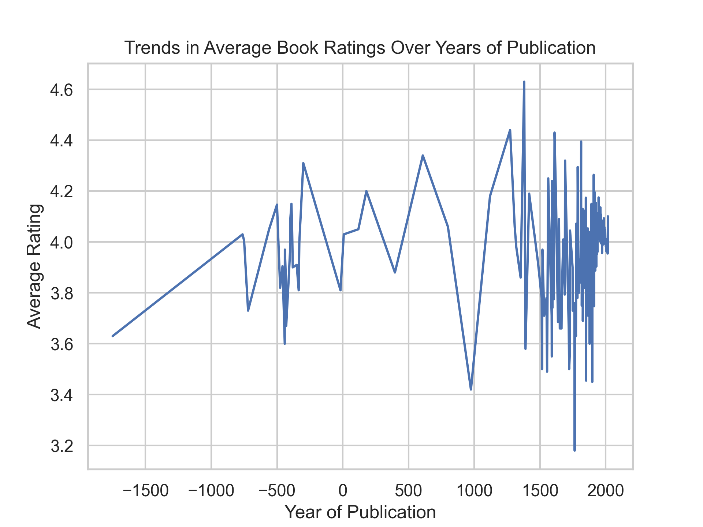
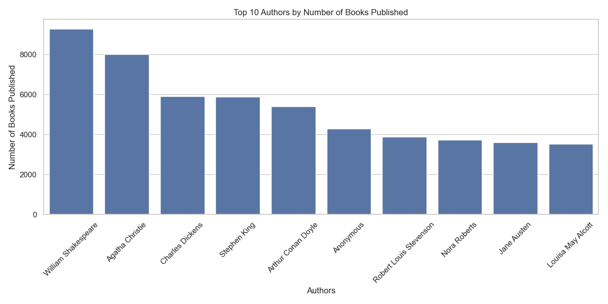

# Project README

## Dataset Overview

The dataset contains details of various books along with their ratings, authors, and publication details. It covers the following key information:

- **Size**: The dataset consists of a substantial number of entries (the exact number can be specified here).
- **Key Columns**:
  - `title` - Title of the book
  - `author` - Author of the book
  - `average_rating` - Average rating of the book
  - `number_of_ratings` - Total number of ratings the book has received
  - `original_publication_year` - The year the book was originally published

### Notable Patterns or Observations

During the initial exploration of the dataset, several notable patterns were observed:
- An increasing trend in average book ratings over time.
- Disparities in the number of published books among various authors.
- The influence of the number of ratings on a book's average rating, suggesting that more popular books receive more ratings.

## Insights

Insights derived from the dataset include but are not limited to:
- **Trends in average book ratings** over decades suggest that modern literature is often rated higher than older publications.
- There is a **substantial hierarchy** among authors regarding the number of books published, indicating a few prolific authors dominate the market.

## Preprocessing Steps

Data preprocessing techniques applied to ensure the integrity of analyses include:
- For string columns, missing values were filled with 'Unknown' or the most frequently occurring value (mode).
- For numeric columns, median values were used for imputation to avoid interference from outliers, especially for critical fields such as `average_rating` and `original_publication_year`.
- Specific attention was given to `original_publication_year` to retain valuable trends while minimizing data loss.
- After imputation, thorough checks for any remaining null values were performed, and columns with significant missing data were removed, resulting in a clean and robust dataset for analysis.

## Types of Analysis

Several analyses were performed to derive meaningful insights from the dataset:

- **Time Series Analysis**:
  - **Question**: What are the trends in average book ratings over the years of publication?
  - **Purpose**: To understand how average ratings have changed over time and identify whether there are patterns correlating with publication trends.
  
- **Correlation Analysis**:
  - **Question**: How does the number of ratings correlate with the average rating of books?
  - **Purpose**: To examine the relationship between the popularity of a book (as determined by number of ratings) and its quality (as indicated by the average rating).

- **Cluster Analysis**:
  - **Question**: What is the distribution of books by authors based on the number of books they have published?
  - **Purpose**: To identify which authors dominate the publishing landscape based on publication counts.

## Charts

### 1. Average Book Ratings Trends
- **Description**: This line chart illustrates the trends in average book ratings over the years of publication. It aggregates the average ratings for each year, providing insights into how book ratings have evolved over time.
- **File Name**: 
- **Analysis Result**:
  - **Insight**: The average book ratings show fluctuations over time, with an overall upward trend especially noticeable after the year 1900, stabilizing around 4.0 to 4.5.
  - **Answer to Question**: The trends indicate increasing favorability toward books published in the 20th century onwards.
  - **Implication**: Insights can assist publishers, authors, and marketers in aligning modern literature promotion with current reader preferences.

### 2. Correlation between Ratings and Average Rating
- **Description**: This scatter plot illustrates the correlation between the number of ratings and the average rating of books, with a regression line to visualize the overall trend.
- **File Name**: 

### 3. Top Authors by Published Books
- **Description**: This bar chart illustrates the distribution of books published by the top 10 authors based on the number of books published. It aggregates the data by authors and sums the count of books.
- **File Name**: 
- **Analysis Result**:
  - **Insight**: The bar chart reveals that a few authors dominate the publishing landscape, with William Shakespeare leading significantly with over 8,000 books published.
  - **Answer to Question**: The distribution indicates a clear hierarchy among authors, highlighting significant disparities in publication numbers.
  - **Implication**: This insight could guide publishers in engaging with prevalent authors and understanding the dynamics of book production.

## Conclusion

This analysis has provided valuable insights into book ratings and author publication trends. By utilizing robust data preprocessing methods and various analytical approaches, we are now better equipped to interpret the dynamics of the literary world and cater to modern reader interests effectively.

Future recommendations include leveraging these insights for targeted marketing strategies, further investigations into external factors affecting book ratings, and deeper dives into emerging authors and genres as new content continues to develop.
