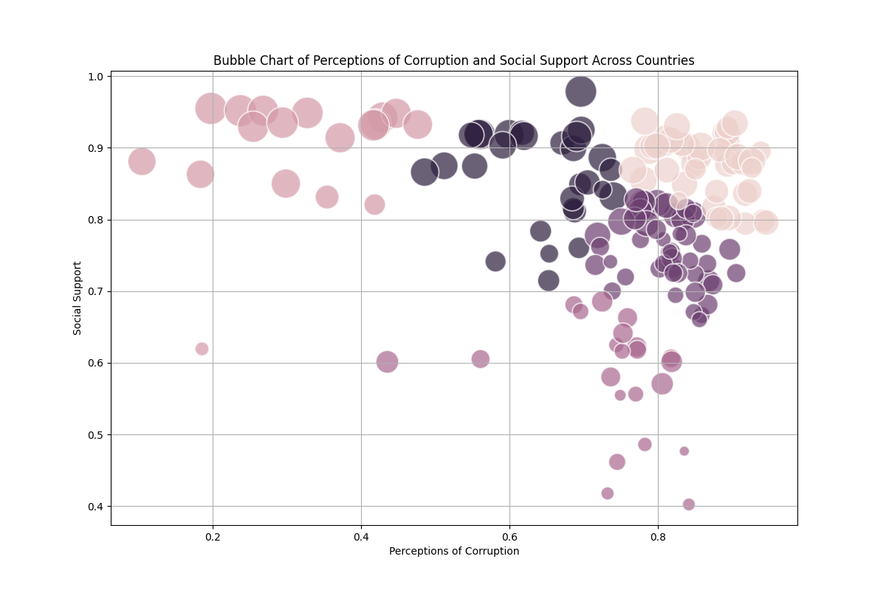

# Data Analysis Storytelling README

## Project Overview
This project explores happiness and socio-economic data pertaining to Afghanistan, covering the years from 2008 to 2016. The aim is to analyze the relationship between various indicators like GDP, life expectancy, perceptions of corruption, and social support to derive actionable insights that can inform policy decisions and improve quality of life within the context of Afghanistan.

## 1. Dataset Overview
The dataset consists of country-wise happiness and socio-economic data for Afghanistan, spanning a total of **9 years (2008-2016)**. It features multiple columns, with significant ones including:
- **Log GDP per capita**
- **Life Ladder (Happiness Score)**
- **Healthy Life Expectancy at Birth**
- **Social Support**
- **Perceptions of corruption**
- **Generosity**
- **Positive affect**
- **Negative affect**

### Notable Observations
- The dataset reveals varying trends in life satisfaction, economic indicators, and health metrics, significantly emphasizing the relationship between economic stability and perceived happiness.

## 2. Insights
From the data analysis, the following insights can be inferred:
- There is a strong positive correlation between GDP and life satisfaction, suggesting that as economic conditions improve, perceived happiness increases.
- Trends in Healthy Life Expectancy indicate most countries, including Afghanistan, are making progress in improving health metrics over time.
- The perception of corruption has a notable negative impact on social support scores, indicating that countries with lower corruption show higher social cohesion.

## 3. Preprocessing Steps
To prepare the data for analysis, the following preprocessing steps were undertaken:
- **Median imputation** was used for numeric columns like 'Log GDP per capita', 'Social support', and 'Freedom to make life choices' due to the presence of outliers.
- **Mean imputation** was used for 'Healthy life expectancy at birth' as it broadly affects public health metrics.
- For categorical columns with missing values, the default was set to **'Unknown'**.
- Rows with extensive missing entries were eliminated from the dataset to maintain data integrity.

## 4. Types of Analysis
Three key analyses were performed:
1. **Correlation Analysis**: Examining the relationship between Log GDP per capita and Life Ladder scores, selected to direct policy decisions around economic growth.
2. **Time Series Analysis**: Observing trends in Healthy Life Expectancy to assess health improvements over time, significant for public health strategies.
3. **Cluster Analysis**: Understanding perceptions of corruption in relation to social support scores, important for identifying societal trust levels.

## 5. Charts
Here are the generated charts from the analysis:

### 5.1. GDP vs Life Ladder Correlation

**Description**: A scatter plot illustrating the correlation between Log GDP per capita and Life Ladder scores across different countries and years.
**Purpose**: To showcase the relationship between economic indicators and subjective well-being.

**Analysis Result**:
- **Insight Discovered**: Positive correlation between GDP and Life Ladder scores; wealthier countries report higher life satisfaction.
- **Answer**: Strong positive correlation indicates that higher GDP associates with better life quality.
- **Implication**: Focus should be on growing the economy alongside strategies to improve quality of life.

### 5.2. Healthy Life Expectancy Trends

**Description**: Line chart displaying Healthy Life Expectancy trends across various countries over both years selected.
**Purpose**: To visualize changes in health metrics over time.

**Analysis Result**:
- **Insight Discovered**: Distinct health metrics trends observed across multiple nations, especially notable improvements in Afghanistan.
- **Answer**: Indications of progress in health expectancy, yet stagnation in countries like Albania requires scrutiny.
- **Implication**: Targeted policy actions for countries in decline to understand underlying factors.

### 5.3. Bubble Chart of Perceptions of Corruption and Social Support

**Description**: Bubble chart illustrating the relationship between perceptions of corruption and social support scores. Size represents Life Ladder scores.
**Purpose**: To emphasize how corruption perceptions impact community well-being.

**Analysis Result**:
- **Insight Discovered**: Negative correlation between corruption perceptions and social support. Higher corruption relates to lower social support.
- **Answer**: Variation across countries demonstrates how trust is compromised by corruption.
- **Implication**: Reducing corruption can enhance social support, leading to improved community well-being.

## Conclusion
Through thorough analysis of the happiness and socio-economic indicators of Afghanistan, this project highlights critical junctions where policymakers can intervene to uplift quality of life and tackle systemic issues effectively. Further investigations into stagnating metrics are recommended to foster a comprehensive path forward.