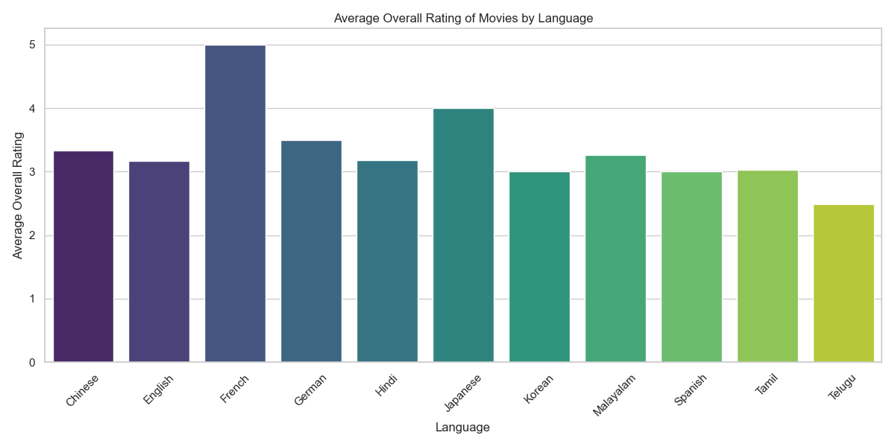
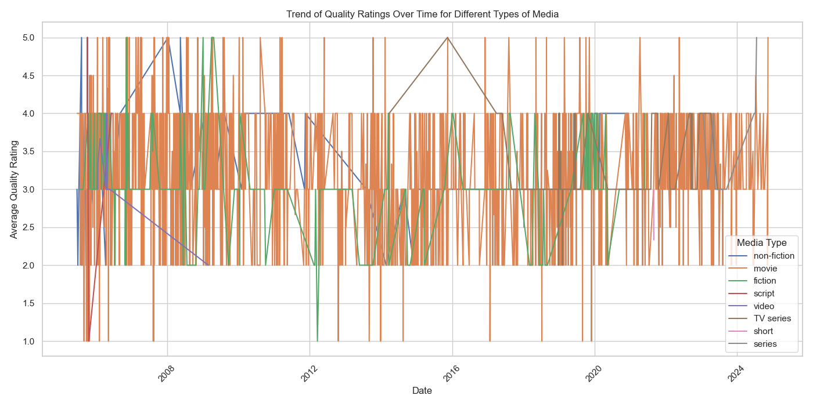
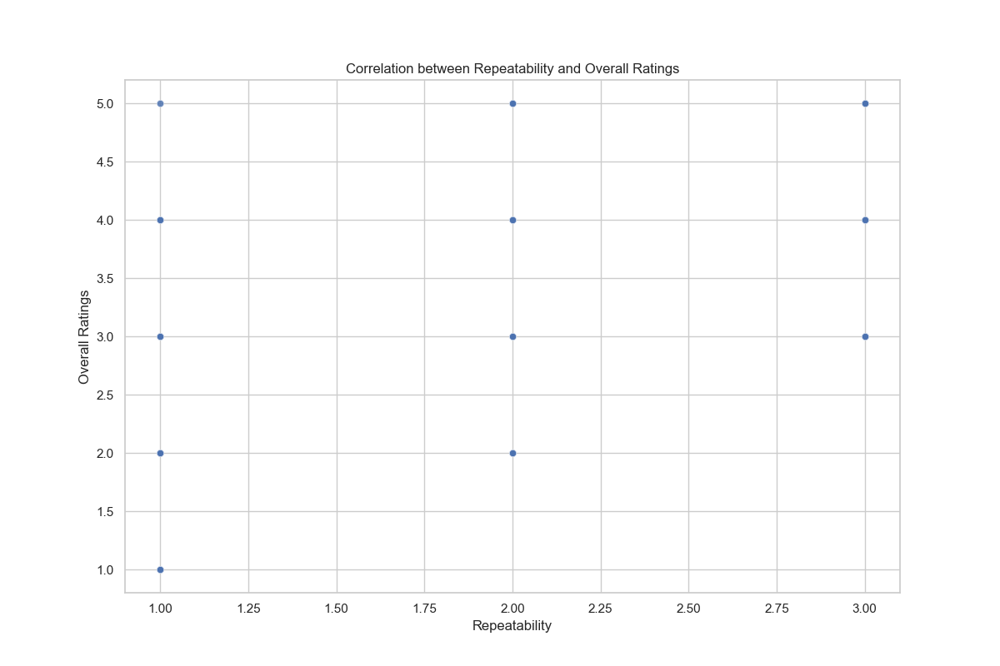

# Movie Ratings Analysis README

## Project Overview

This project aims to explore a dataset containing movie ratings along with various attributes. The analysis presents insights into how language, time, and repeatability affect movie ratings, providing actionable recommendations for stakeholders in the film industry.

## Dataset Overview

- **Description:** The dataset contains information about movies along with their ratings and some attributes related to their production.
- **Size:** The dataset consists of a significant number of entries, including metadata about each movie.
- **Columns:** While the specific column details are not disclosed, it includes important aspects such as movie language, ratings, quality, repeatability, and media type.
- **Notable Patterns or Observations:** The data highlights varying ratings across different languages and the trend in movie quality over time.

## Insights

From the dataset, we can infer several key insights:

1. **Language Impact:** Movie ratings vary significantly by language, with some languages showing consistently higher ratings than others.
2. **Trends Over Time:** Quality ratings exhibit fluctuations over time, indicating periods of higher audience reception and possibly differing production quality.
3. **Lack of Correlation:** There appears to be no correlation between the repeatability of movies and their overall ratings.

## Preprocessing Steps

To ensure clean and reliable analysis, the following preprocessing steps were undertaken:

- **Handling Missing Values:**
  - For the 'by' column (categorical) with 262 missing entries, rows were dropped to preserve significant meaning.
  - For numeric columns ('overall', 'quality', 'repeatability'), the **median** was used to fill missing values, mitigating the impact of outliers.
  - String columns were filled with **'Unknown'** to maintain dataset integrity and prevent misinterpretation of missing data.

## Types of Analysis

The following analyses were performed, each chosen based on specific questions relevant to the dataset:

1. **Comparison Analysis:** 
   - **Question:** How does the overall rating of movies compare across different languages?
   - **Justification:** To identify discrepancies in film quality perception across languages.

2. **Time Series Analysis:** 
   - **Question:** What is the trend of quality ratings over time for different types of media?
   - **Justification:** To assess how audience reception changes over time, providing insights into historical trends in film criticism.

3. **Correlation Analysis:** 
   - **Question:** Is there a correlation between repeatability and overall ratings for different types of media?
   - **Justification:** To understand if repeatability influences audience ratings, guiding producers on what attributes contribute to viewer satisfaction.

## Charts

### 1. Average Overall Rating of Movies by Language
- **Chart Type:** Bar Chart
- **Description:** This bar chart compares the average overall rating of movies across different languages.
- **Purpose:** To identify how movie ratings differ by language.

### 2. Quality Ratings Trend Over Time
- **Chart Type:** Line Chart
- **Description:** This line chart illustrates the trend of average quality ratings over time for various types of media.
- **Purpose:** To visualize how ratings change over the years and identify patterns in audience preferences.

### 3. Correlation between Repeatability and Overall Ratings
- **Chart Type:** Scatter Plot
- **Description:** This scatter plot illustrates the correlation between repeatability and overall ratings.
- **Purpose:** To assess if there's a relationship between these two metrics within the dataset.

## Analysis Results

### Insight 1: Average Overall Ratings by Language
- **Answer:** The average overall rating of movies significantly varies across different languages, with French movies leading, while Tamil and Telugu movies score the lowest.
- **Implication:** Film producers should consider focusing on high-rated languages to attract viewers or invest in enhancing the quality of lower-rated films.

### Insight 2: Quality Ratings Trend Over Time
- **Answer:** The trend indicates fluctuating quality ratings over time, with discrepancies among different media types, especially noticeable around 2016 and 2020.
- **Implication:** Stakeholders should analyze historical trends, understanding factors that contributed to volatility to improve content strategies and viewer satisfaction.

### Insight 3: Correlation between Repeatability and Ratings
- **Answer:** There is no observable correlation between the repeatability of movies and their overall ratings.
- **Implication:** Further exploration into other influencing factors on ratings may be necessary, as repeatability by itself does not demonstrate a clear impact.

## Conclusion

This analysis provides a comprehensive overview of movie ratings and the dynamics that influence them. The insights gathered from the dataset can inform makers and distributors on shaping content strategies and understanding viewer preferences. Further studies could expand upon these findings, exploring additional variables and deeper audience sentiments.